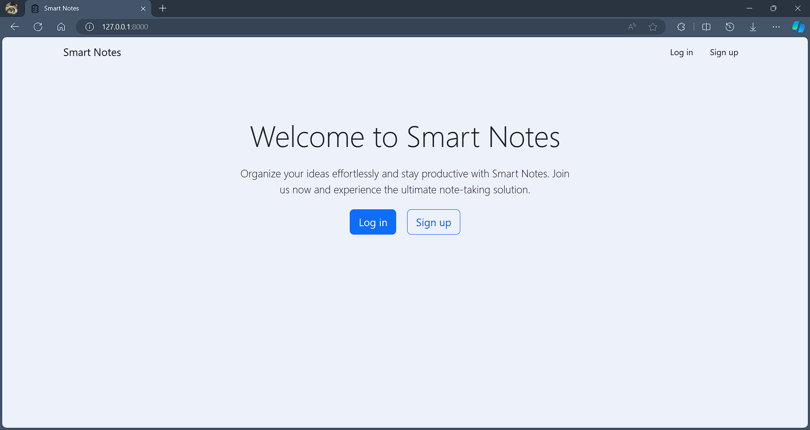
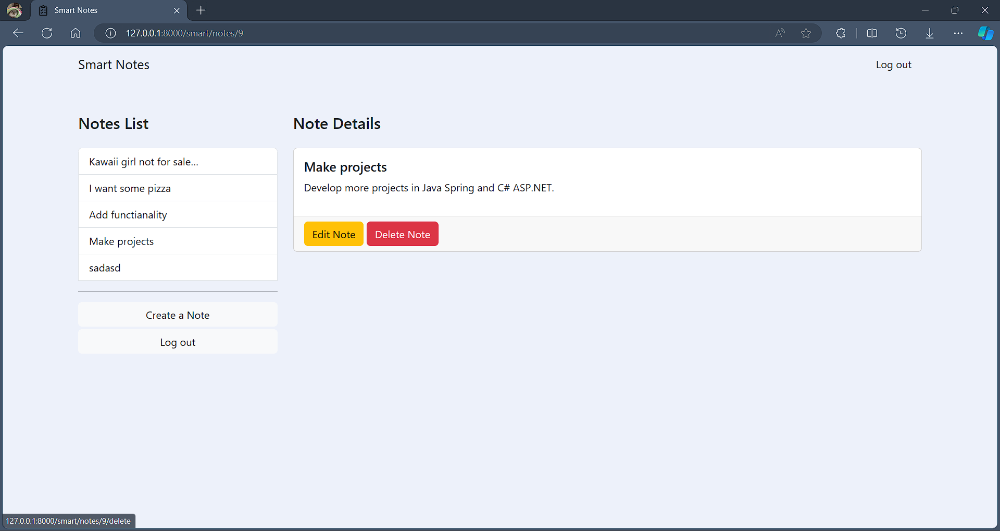

# Smart Notes

A Django web application that allows users to create and store notes. It provides user authentication and allows users to register for an account and login to access their notes.

## Installation

1. `virtualenv YOURENVNAME` - create new [virtualenv](https://virtualenv.pypa.io/en/stable/) for this project (not necessary, but recommended).
2. Navigate to directory containing `requirements.txt`.
3. `pip install -r requirements.txt` - install required packages
4. Also need `.env` file that placed `SECRET_KEY`.

## Usage

On first usage you'll need to apply database migrations: `python manage.py migrate`

Otherwise run development server using: `python manage.py runserver`

## Work example

The picture below is an example of work.

